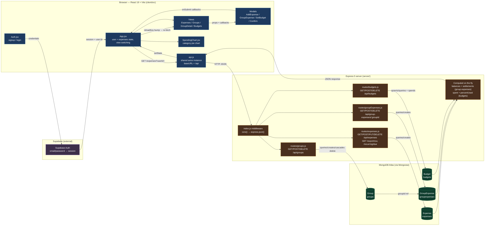

# Architecture & Data Flow

This diagram maps how data flows through the expense tracker — from the React frontend, through the Express API, into MongoDB Atlas, and back.

## How to read it

1. **Auth** — `Auth.jsx` talks only to Supabase; the backend never sees credentials. The resulting `user.id` is passed to the API as `?userId=` query param / body field (trust-based, no JWT on the server).
2. **Requests** — every component call goes through the single axios instance in `api.js`, which hits `index.js`. Two middleware run: CORS and JSON body parsing.
3. **Routing** — the request lands on one of four routers, which build/run Mongoose queries against MongoDB Atlas.
4. **Computed data** — group balances/settlements and budget `spent`/`percentUsed` are computed per-request in route handlers, never stored.
5. **Responses** — JSON flows back to `App.jsx` state and down to views/charts via props.
6. **Mutations** — modals collect data → `App` calls the API → bumps a `reloadKey` → the affected view re-fetches.